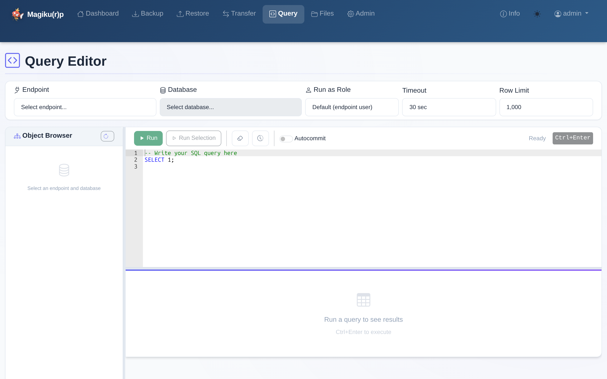

# MagikUp - PostgreSQL Backup & Restore

A web application for PostgreSQL database backup, restore, and transfer operations. Supports both **direct connections** and **AWS SSM tunnel** connections through configurable jump hosts.

## Features

- **Backup** - Full or schema-level backups with advanced pg_dump parameters and real-time progress
- **Restore** - Restore from backup files with advanced pg_restore parameters, schema selection, table exclusion, role mapping, and TimescaleDB-aware mode
- **Transfer** - One-click database copy (backup + restore) between any endpoints
- **Query Editor** - Execute SQL queries directly on any endpoint with Ace editor, object browser, autocommit toggle, result export, query history, and contextual tooltips
- **Info Page** - Application info, version history, technology stack, and documentation links (HTML manual, PDF download)
- **Dual Connection Mode** - Direct TCP or AWS SSM tunnel per endpoint
- **Jump Host Management** - Configure multiple EC2 jump hosts for SSM tunneling
- **File Manager** - Upload, download, and manage backup files (up to 5GB)
- **Real-time Progress** - WebSocket-based live output streaming
- **Operation History** - Audit trail with downloadable logs
- **Configuration Import/Export** - Single unified config file for easy portability
- **Multi-User Auth** - Three roles (Admin, Operator, Viewer) with granular permissions
- **Security Hardening** - Rate limiting, account lockout, password policy, audit log
- **Context Path / Reverse Proxy** - Deploy under a URL prefix (e.g., `/magikup`) via env var, config file, or Admin UI
- **Kubernetes Ready** - Full manifest set with Kustomize, PVCs, health checks, and ingress

## Architecture

```
┌─────────────────────────────────────────────────────────┐
│                    Browser (UI)                          │
│  Dashboard | Backup | Restore | Transfer | Query | Files | Admin│
└──────────────────────┬──────────────────────────────────┘
                       │ HTTP / WebSocket
┌──────────────────────▼──────────────────────────────────┐
│                  FastAPI (main.py)                        │
│  Routes + WebSocket Handlers + Role-Based Auth           │
├──────────────┬───────────────────────┬──────────────────┤
│  config.py   │  backup_restore.py    │  ssm_tunnel.py   │
│  (INI file)  │  (pg_dump/restore)    │  (AWS SSM)       │
├──────────────┼───────────────────────┼──────────────────┤
│  auth.py     │  operation_logger     │  aws_service     │
│  (users/rbac)│  (audit trail)        │  (boto3)         │
├──────────────┼───────────────────────┼──────────────────┤
│  db_service  │  users.json           │  audit.log       │
│  (psycopg2   │  (user store)         │  (security log)  │
│   + queries) │                       │                  │
└──────┬───────┴───────────┬───────────┴────────┬─────────┘
       │                   │                    │
  Direct TCP          Log Files           SSM Tunnel
       │                   │              (port forward)
       ▼                   ▼                    ▼
  ┌─────────┐      ┌───────────┐      ┌──────────────┐
  │PostgreSQL│      │   /logs/  │      │ EC2 Jumphost │
  │ Database │      │   /backups│      │  (SSM Agent) │
  └─────────┘      └───────────┘      └──────┬───────┘
                                              │
                                       ┌──────▼───────┐
                                       │  RDS/Aurora   │
                                       │  PostgreSQL   │
                                       └──────────────┘
```

## Quick Start

### Docker

```bash
# Build and run with docker-compose
docker compose up -d

# Or build and run manually
docker build -t magikup:latest .
docker run -d \
  -p 8000:8000 \
  -v magikup-backups:/backups \
  -v magikup-config:/app/config \
  -v magikup-logs:/app/logs \
  --name magikup \
  magikup:latest

# Open browser
open http://localhost:8000
```

Default credentials: `admin` / `admin123` (change immediately via Admin > Users)

### Advanced Backup Parameters

The backup page includes an **Advanced Parameters** toggle that exposes fine-grained pg_dump options:

| Parameter | Default | Description |
|-----------|---------|-------------|
| `--large-objects` | On | Include large objects (BLOBs) in the dump |
| `--no-owner` | On | Skip ownership assignment commands |
| `--no-privileges` | On | Skip GRANT/REVOKE privilege commands |
| `--no-tablespaces` | On | Skip tablespace assignment commands |
| `--no-comments` | On | Skip COMMENT commands |
| `--data-only` | Off | Dump data only, no schema (DDL). Mutually exclusive with `--schema-only` |
| `--schema-only` | Off | Dump schema (DDL) only, no data. Mutually exclusive with `--data-only` |
| `--clean` | Off | Add DROP commands before CREATE |
| `--create` | Off | Include CREATE DATABASE command |
| `--exclude-table` | Off | Exclude tables matching a glob pattern (e.g. `temp_*`) |
| `--exclude-table-data` | Off | Exclude data for tables matching a glob pattern |

All parameters include tooltip popups with detailed descriptions. Table exclusion patterns support `*` and `?` wildcards and are validated against shell injection.

### Advanced Restore Parameters

The restore page includes an identical **Advanced Parameters** toggle exposing fine-grained pg_restore options:

| Parameter | Default | Description |
|-----------|---------|-------------|
| `--clean` | On | Drop database objects before recreating. Uses `--if-exists` to avoid errors |
| `--no-owner` | On | Skip ownership assignment commands |
| `--no-privileges` | On | Skip GRANT/REVOKE privilege commands |
| `--no-tablespaces` | On | Skip tablespace assignment commands |
| `--no-comments` | On | Skip COMMENT commands |
| `--data-only` | Off | Restore data only, no schema (DDL). Mutually exclusive with `--schema-only` |
| `--schema-only` | Off | Restore schema (DDL) only, no data. Mutually exclusive with `--data-only` |
| `--exit-on-error` | Off | Stop at first error instead of continuing |
| `--no-publications` | On | Skip publication definitions |
| `--no-subscriptions` | On | Skip subscription definitions |
| `--jobs N` | Off | Number of parallel restore processes (1-8) |
| `TimescaleDB` | Off | Run `timescaledb_pre_restore()` before and `timescaledb_post_restore()` after pg_restore; adds `--disable-triggers`. Requires superuser and the `timescaledb` extension on the target database |

**Exclusions:**

| Feature | Description |
|---------|-------------|
| Exclude schemas | One schema per line, passed as `--exclude-schema` to pg_restore |
| Exclude tables | Wildcard patterns (`*`, `?`) via TOC filtering (`pg_restore --list` + `--use-list`) |

Table exclusion uses TOC-based filtering since pg_restore has no native `--exclude-table` flag: the backup's table of contents is listed, matching entries are commented out, and the filtered TOC is passed via `--use-list`.

### Query Editor

The Query Editor page provides a full-featured SQL execution environment:

- **Ace Editor** with PostgreSQL syntax highlighting, auto-completion, and dark mode support
- **Object Browser** - Tree view of schemas, tables, views, functions, and indexes (lazy-loaded)
- **Connection Bar** - Select endpoint, database, role, timeout (5-300s), and row limit (100-10,000)
- **Autocommit Toggle** - Switch in the toolbar (next to History button) to enable/disable autocommit; reads default from the `[query]` section in `config.ini`
- **Results Table** - Sortable results with sticky headers, NULL highlighting, row count, and execution time
- **CSV Export** - Export query results to CSV
- **Query History** - Last 50 queries stored in browser localStorage
- **Keyboard Shortcuts** - Ctrl+Enter (Cmd+Enter on Mac) to execute
- **Contextual Tooltips** - Explanatory tooltips on all buttons, dropdowns, and form elements

Security: Queries run with a server-side `statement_timeout` and row limit. `SET ROLE` uses `sql.Identifier()` to prevent injection. The `execute_query` function in `db_service.py` accepts an `autocommit` parameter to control transaction behavior per query.



### Local Development

```bash
pip install -r requirements.txt
python run.py --reload
```

## Multi-User Authentication

### Roles

| Role | Description |
|------|-------------|
| **Admin** | Full access: manage users, endpoints, config; run all operations on all endpoints |
| **Operator** | Run backups/restores/transfers, SQL queries and tunnels — using the **stored endpoint credentials**. Grant it as you would database-operator access, not as a limited role. |
| **Viewer** | Read-only UI: view dashboard, endpoints and operation history. Cannot download backups or run operations. |

### Permissions Matrix

| Area | Admin | Operator | Viewer |
|------|-------|----------|--------|
| Dashboard (read) | Y | Y | Y |
| Run backup/restore/transfer | Y | Y | N |
| Execute SQL queries | Y | Y | N |
| Manage files (upload/delete) | Y | Y | N |
| View endpoints/operations | Y | Y | Y |
| Download backup files | Y | Y | N |
| Admin page (config/endpoints/users) | Y | N | N |
| Clear operations history | Y | N | N |
| Change own password | Y | Y | Y |
| Endpoint access | All | Assigned allowlist¹ | Assigned allowlist¹ |

¹ Each non-admin user has an **endpoint allowlist** (default `["*"]` = all). Restrict it per user in Admin > Users ("Allowed endpoints"). Scoped users only see and can act on their assigned endpoints; everything else returns 403. Admins always have access to all endpoints.

### Read-only Endpoints

An endpoint can be flagged **Read-only** (Admin > Endpoints). For such endpoints:

- The Query Editor connects with `default_transaction_read_only=on`, so any write statement is rejected by PostgreSQL itself.
- **Restore** and **transfer to** that endpoint are refused.
- Backups (which only read) still work.

Use it to expose production databases for safe querying without risk of accidental writes.

### User Management

Users are stored in `config/users.json` (auto-created on first startup from config.ini). Manage users from the Admin panel > Users tab:

- Create/edit/delete users
- Assign roles
- Enable/disable accounts
- Unlock locked accounts
- Reset passwords

### Admin Settings

The Admin > Settings tab includes configuration sections for:

- **Application Settings** - Backup directory, pg_dump/pg_restore paths, max upload size
- **Network** - Context path for reverse proxy deployment (overridden when `ROOT_PATH` env var is set)
- **AWS Configuration** - Access keys, region
- **Query Editor** - Default autocommit toggle for the Query Editor

### Security Features

- **Rate Limiting**: 5 failed login attempts per IP → blocked for 5 minutes
- **Account Lockout**: 10 failed login attempts for a user → account locked (admin can unlock)
- **Password Policy**: Minimum 8 characters, 1 uppercase, 1 lowercase, 1 digit
- **Audit Log**: All security events logged to `config/audit.log` (viewable in Admin panel)

## Configuration

All configuration is stored in `config/config.ini`. User accounts are in `config/users.json`.

### Configuration Sections

#### `[settings]` - Application Settings

| Key | Default | Description |
|-----|---------|-------------|
| `backup_dir` | `/backups` | Directory for backup files |
| `pg_dump_path` | `/usr/bin/pg_dump` | Path to pg_dump executable |
| `pg_restore_path` | `/usr/bin/pg_restore` | Path to pg_restore executable |
| `max_upload_size_gb` | `5` | Maximum upload file size in GB |
| `context_path` | (empty) | URL prefix for reverse proxy deployment (e.g., `/magikup`) |

#### `[auth]` - Authentication Settings

| Key | Default | Description |
|-----|---------|-------------|
| `session_timeout_minutes` | `480` | Session timeout (8 hours) |

#### `[aws]` - AWS Credentials (optional)

Only needed if any endpoint uses SSM tunneling.

| Key | Default | Description |
|-----|---------|-------------|
| `access_key_id` | (empty) | AWS Access Key ID |
| `secret_access_key` | (empty) | AWS Secret Access Key |
| `region` | `us-east-1` | AWS Region |

#### `[jumphosts]` - Jump Host Servers

EC2 instances with SSM agent for port forwarding.

```ini
[jumphosts]
# Format: alias = instance_id
production-jh = i-0123456789abcdef0
staging-jh = i-0abc123def456789
```

#### `[query]` - Query Editor Settings

| Key | Default | Description |
|-----|---------|-------------|
| `autocommit` | `false` | Default autocommit state for the Query Editor |

#### `[endpoints]` - Database Endpoints

```ini
[endpoints]
# Format: name = host|port|username|password|use_ssm|jumphost_alias|read_only
#
# Direct connection (no SSM):
local-db = 10.0.1.100|5432|postgres|mypassword|false||false
#
# SSM tunnel connection:
prod-aurora = aurora-cluster.rds.amazonaws.com|5432|admin|ENC:...|true|production-jh|false
#
# Read-only endpoint (query editor read-only; restore/transfer refused):
prod-readonly = reporting.rds.amazonaws.com|5432|readonly|ENC:...|false||true
```

| Field | Description |
|-------|-------------|
| `name` | Endpoint identifier (used in dropdowns) |
| `host` | Database host/endpoint |
| `port` | Database port (typically 5432) |
| `username` | PostgreSQL username |
| `password` | Password (plain or `ENC:` encrypted) |
| `use_ssm` | `true` or `false` - whether to use SSM tunnel |
| `jumphost_alias` | Reference to `[jumphosts]` key (empty if direct) |
| `read_only` | `true` or `false` (optional, default `false`) - blocks writes: query editor read-only, restore/transfer to it refused |

> Backward compatible: existing 6-field entries (without `read_only`) are read as `read_only = false`.

### Configuration Import/Export

From the Admin page:
- **Download**: Click "Download Configuration" to export `config.ini`
- **Import**: Upload a `config.ini` file to replace current config

This makes it easy to migrate settings between environments.

## Context Path / Reverse Proxy

MagikUp can be served under a URL prefix (e.g., `https://example.com/magikup`) instead of the root. This is useful when deploying behind a reverse proxy that routes multiple applications on different paths.

### Configuration Methods (priority order)

| Method | How to set | Takes effect |
|--------|-----------|--------------|
| **`ROOT_PATH` env var** (highest priority) | `ROOT_PATH=/magikup` | On container/process start |
| **`context_path` in config.ini** | `[settings]` section: `context_path = /magikup` | After restart |
| **Admin UI** | Settings > Network > Context Path | After restart |

When `ROOT_PATH` is set, it overrides the config file value. The Admin UI shows a badge indicating the override.

### Nginx Reverse Proxy Example

```nginx
location /magikup/ {
    proxy_pass         http://localhost:8000/;
    proxy_set_header   Host              $host;
    proxy_set_header   X-Real-IP         $remote_addr;
    proxy_set_header   X-Forwarded-For   $proxy_add_x_forwarded_for;
    proxy_set_header   X-Forwarded-Proto $scheme;

    # WebSocket support
    proxy_http_version 1.1;
    proxy_set_header   Upgrade    $http_upgrade;
    proxy_set_header   Connection "upgrade";

    # Large backup uploads
    client_max_body_size 5g;
}
```

Set `ROOT_PATH=/magikup` so the application generates correct URLs and redirects.

### Docker Compose Example

```yaml
services:
  magikup:
    image: magikup:latest
    ports:
      - "8000:8000"
    environment:
      - ROOT_PATH=/magikup
    volumes:
      - magikup-backups:/backups
      - magikup-config:/app/config
      - magikup-logs:/app/logs
```

### Health Check

The `/health` endpoint always responds at the root path (without the prefix), so Kubernetes probes and Docker health checks do not need to include the context path:

```
http://localhost:8000/health   # always works, regardless of ROOT_PATH
```

## SSM Tunnel Setup

### Prerequisites

1. **AWS CLI v2** installed in the container (included in Dockerfile)
2. **Session Manager Plugin** installed (included in Dockerfile)
3. **EC2 Instance** with SSM agent running (the jump host)
4. **IAM Permissions**: `ssm:StartSession` on the jump host instance
5. **Network**: Jump host must have network access to the target database

### How It Works

1. You configure a jump host (EC2 instance ID) in the Admin panel
2. You mark an endpoint as "Requires SSM Tunnel" and assign a jump host
3. When you start a backup/restore/transfer, the app automatically:
   - Opens an SSM port-forwarding session through the jump host
   - Routes the pg_dump/pg_restore connection through the tunnel
   - Reuses existing tunnels if one is already active
4. The tunnel stays alive until stopped or the pod restarts

### Network Flow

```
App Pod → SSM Session → EC2 Jump Host → VPC Network → RDS/Aurora DB
(localhost:15432)                                     (db.rds:5432)
```

## Kubernetes Deployment

### Prerequisites

- Kubernetes cluster with `kubectl` access
- Nginx Ingress Controller installed
- Storage class for PVCs
- Access to a container registry (e.g., GHCR / GitHub Container Registry)

### Quick Deploy

```bash
# 1. Build and push image
docker build -t ghcr.io/fpellizz/magikup:3.4.0 .
docker push ghcr.io/fpellizz/magikup:3.4.0

# 2. Configure secrets (generates encryption key and creates secret.yaml)
./scripts/create-secret.sh

# 3. Update ingress hostname
# Edit kubernetes/ingress.yaml — replace magikup.example.com with your hostname

# 4. Deploy everything with Kustomize
kubectl apply -k kubernetes/

# 5. Verify
kubectl get pods -l app=magikup
kubectl logs deploy/magikup

# 6. Access (port-forward or via ingress)
kubectl port-forward svc/magikup 8000:8000
```

### Manifest Files

| File | Resource | Description |
|------|----------|-------------|
| `rbac.yaml` | ServiceAccount `magikup` | Pod identity (automount disabled) |
| `configmap.yaml` | ConfigMap `magikup-config` | Default config.ini template |
| `secret.yaml` | Secret `magikup-secret` | Fernet encryption key |
| `pvc.yaml` | 3 PVCs | Persistent storage for backups, config, logs |
| `networkpolicy.yaml` | NetworkPolicy `magikup` | Restrict ingress/egress traffic |
| `deployment.yaml` | Deployment `magikup` | Hardened pod with seccomp, read-only rootfs |
| `service.yaml` | Service `magikup` | ClusterIP with session affinity |
| `ingress.yaml` | Ingress `magikup` | Nginx ingress with TLS, rate limiting, security headers |
| `kustomization.yaml` | Kustomization | Apply all resources with `kubectl apply -k` |

### Persistent Volumes

| PVC | Size | Mount Path | Purpose |
|-----|------|------------|---------|
| `magikup-backups` | 50Gi | `/backups` | Backup files |
| `magikup-config` | 1Gi | `/app/config` | config.ini, users.json, audit.log |
| `magikup-logs` | 1Gi | `/app/logs` | Application logs |

### Resource Defaults

- **CPU**: 250m request / 2 cores limit
- **Memory**: 512Mi request / 2Gi limit
- **Strategy**: Recreate (required for RWO PVCs)
- **Health checks**: Liveness and readiness probes on `/health`

### Init Container

The deployment includes an init container that copies the default `config.ini` from the ConfigMap to the config PVC on first deploy only. Subsequent deploys preserve the existing configuration (endpoints, users, etc.).

## API Reference

### Pages

| Method | Path | Auth | Description |
|--------|------|------|-------------|
| GET | `/` | All | Dashboard |
| GET | `/backup` | Operator+ | Backup page |
| GET | `/restore` | Operator+ | Restore page |
| GET | `/transfer` | Operator+ | Transfer page |
| GET | `/files` | Operator+ | File manager |
| GET | `/query-editor` | Operator+ | Query editor |
| GET | `/admin` | Admin | Administration |
| GET | `/info` | All | Info page |
| GET | `/about` | All | Redirects to `/info` (backwards compatibility) |
| GET | `/docs/manual` | All | Serves HTML manual (opens in new tab) |
| GET | `/docs/manual.pdf` | All | Downloads PDF manual |
| GET | `/login` | Public | Login page |
| GET | `/change-password` | All | Change password |

### User Management API (Admin only)

| Method | Path | Description |
|--------|------|-------------|
| GET | `/api/users` | List all users |
| POST | `/api/users` | Create user |
| PUT | `/api/users/{username}` | Update user (role, enabled) |
| DELETE | `/api/users/{username}` | Delete user |
| POST | `/api/users/{username}/reset-password` | Reset user password |
| POST | `/api/users/{username}/unlock` | Unlock locked account |
| GET | `/api/audit-log` | View security audit log |

### Endpoints API

| Method | Path | Auth | Description |
|--------|------|------|-------------|
| GET | `/api/endpoints` | All | List all endpoints |
| GET | `/api/endpoints/{name}` | Admin | Get endpoint details (with decrypted password) |
| POST | `/api/endpoints` | Admin | Add/update endpoint |
| DELETE | `/api/endpoints/{name}` | Admin | Delete endpoint |

### Jump Hosts API

| Method | Path | Auth | Description |
|--------|------|------|-------------|
| GET | `/api/jumphosts` | All | List jump hosts |
| POST | `/api/jumphosts` | Admin | Add/update jump host |
| DELETE | `/api/jumphosts/{alias}` | Admin | Delete jump host |

### AWS API

| Method | Path | Description |
|--------|------|-------------|
| GET | `/api/aws/status` | Test AWS connection |
| GET | `/api/aws/clusters` | List Aurora clusters |
| GET | `/api/aws/instances` | List Aurora instances |
| GET | `/api/aws/ssm-instances` | List SSM-capable EC2 instances |

### Tunnels API

| Method | Path | Auth | Description |
|--------|------|------|-------------|
| GET | `/api/tunnels` | All | List active tunnels |
| POST | `/api/tunnels/start` | Operator+ | Start SSM tunnel |
| POST | `/api/tunnels/stop/{id}` | Operator+ | Stop tunnel |

### Database API

| Method | Path | Description |
|--------|------|-------------|
| GET | `/api/databases/{endpoint}` | List databases |
| GET | `/api/schemas/{endpoint}/{db}` | List schemas |
| GET | `/api/users/{endpoint}` | List users/roles |
| GET | `/api/test-connection/{endpoint}` | Test connection |

### Query Editor API

| Method | Path | Auth | Description |
|--------|------|------|-------------|
| POST | `/api/query/execute` | Operator+ | Execute SQL query |
| GET | `/api/tables/{endpoint}/{db}/{schema}` | All | List tables |
| GET | `/api/columns/{endpoint}/{db}/{schema}/{table}` | All | List table columns |
| GET | `/api/views/{endpoint}/{db}/{schema}` | All | List views |
| GET | `/api/functions/{endpoint}/{db}/{schema}` | All | List functions |
| GET | `/api/indexes/{endpoint}/{db}/{schema}` | All | List indexes |

### Backup Files API

| Method | Path | Auth | Description |
|--------|------|------|-------------|
| GET | `/api/backups` | All | List backup files |
| POST | `/api/backups/upload` | Operator+ | Upload backup file |
| GET | `/api/backups/{file}/download` | All | Download backup |
| DELETE | `/api/backups/{file}` | Operator+ | Delete backup |

### Configuration API (Admin only)

| Method | Path | Description |
|--------|------|-------------|
| GET | `/api/config/download` | Download config.ini |
| POST | `/api/config/import` | Import config.ini |
| GET | `/api/config/aws` | Get AWS config |
| POST | `/api/config/aws` | Save AWS config |
| GET | `/api/config/settings` | Get app settings |
| POST | `/api/config/settings` | Save app settings |
| GET | `/api/config/query-settings` | Get query editor settings (autocommit default) |
| POST | `/api/config/query-settings` | Save query editor settings |
| POST | `/api/encrypt-passwords` | Encrypt plain passwords |

### WebSocket Endpoints

| Path | Auth | Description |
|------|------|-------------|
| `/ws/backup` | Operator+ | Backup with real-time progress |
| `/ws/restore` | Operator+ | Restore with real-time progress |
| `/ws/transfer` | Operator+ | Transfer with real-time progress |
| `/ws/operation/{id}/follow` | All | Follow running or view completed operation |

## Security

- **Multi-User Auth**: Role-based access control (Admin, Operator, Viewer)
- **Session Tokens**: Signed with `itsdangerous.URLSafeTimedSerializer`, include role, dynamic Secure flag
- **Password Hashing**: bcrypt with automatic salt
- **Password Policy**: Min 8 chars, 1 uppercase, 1 lowercase, 1 digit
- **Rate Limiting**: IP-based brute-force protection (5 attempts / 5 min)
- **Account Lockout**: Locks account after 10 failed attempts
- **Audit Log**: All security events logged (login, user changes, lockouts)
- **Password Encryption**: Fernet (AES-128) for database passwords at rest
- **Path Traversal Prevention**: Backup file paths validated against backup directory
- **Non-root Container**: Runs as UID 1000 in Kubernetes
- **SQL Injection Prevention**: Parameterized queries via psycopg2

## Troubleshooting

### SSM Tunnel Issues

- **"No jumphost ID configured"**: Add a jump host in Admin > Jump Hosts
- **"Tunnel failed to start"**: Check AWS credentials and jump host SSM agent status
- **"Port not accessible"**: Verify the jump host can reach the target database
- **Tunnel dies after start**: Check `aws ssm start-session` works from the pod

### Connection Issues

- **"Connection failed"**: Verify host/port/credentials in endpoint config
- **Timeout**: Check network connectivity (firewall, security groups)
- **"Authentication failed"**: Verify PostgreSQL username/password

### Backup/Restore Issues

- **"pg_dump not found"**: Check `pg_dump_path` in settings
- **"Restore completed with warnings"**: Normal with `--clean` flag (tries to drop non-existent objects)
- **Large file uploads fail**: Check `max_upload_size_gb` setting and ingress body size annotation

### Auth Issues

- **Account locked**: Admin can unlock from Admin > Users tab
- **Rate limited**: Wait 5 minutes or restart the pod to clear in-memory rate limits
- **Forgot password**: Admin can reset any user's password from Admin > Users tab

## Scripts

| Script | Description |
| ------ | ----------- |
| `scripts/create-secret.sh` | Generate `kubernetes/secret.yaml` with a Fernet encryption key |
| `scripts/build.sh` | Build Docker image |
| `scripts/deploy.sh` | Deploy to Kubernetes cluster |

## Version History

### 3.4.0

- **Backup lock-wait timeout** — new `lock_wait_timeout_seconds` setting (Admin → Settings, default 60s). `pg_dump` is run with `--lock-wait-timeout`, so a backup fails fast instead of blocking forever when it can't acquire shared table locks (e.g. behind a migration / `VACUUM FULL`). `0` = wait forever.
- **Backup from a read replica** — endpoints can be flagged to back up from a read replica instead of the primary. For Aurora hosts the endpoint form detects the cluster endpoint and suggests the reader (`.cluster-` → `.cluster-ro-`); enable it with a switch. Keeps dump locks off the writer. Stays engine-agnostic (still plain `pg_dump`).

### 3.3.0

- **Read-only endpoints** — flag an endpoint as read-only: the Query Editor connects with `default_transaction_read_only=on` (writes rejected by PostgreSQL) and restore/transfer to it are refused
- **Per-user endpoint scoping** — each non-admin user has an endpoint allowlist; scoped users only see and act on their assigned endpoints
- **Security hardening** — pg_dump/pg_restore path allowlist, SSM tunnel host validation, same-origin CSRF check, `TrustedHostMiddleware`, proxy-header aware rate limiting/audit, operator-only backup download, atomic user-store writes, destructive-restore confirmation, and more

### 3.2.0

- **TimescaleDB-aware restore** — new TimescaleDB toggle in the Restore and Transfer advanced parameters. When enabled, the app runs `SELECT timescaledb_pre_restore()` before and `SELECT timescaledb_post_restore()` after pg_restore, and adds `--disable-triggers` to the pg_restore command
- **Robust error handling** — if `timescaledb_pre_restore()` fails the restore is aborted before pg_restore runs; if `timescaledb_post_restore()` fails the operation is reported as failed even when pg_restore succeeded (the DB is left in inconsistent state)
- **Requirements** — the target database must have the `timescaledb` extension installed and the connecting user must be a superuser

### 3.1.0

- **Context Path / Reverse Proxy** — deploy under a URL prefix (e.g., `/magikup`) via `ROOT_PATH` env var or `context_path` in config.ini
- **Admin Network section** — manage context path from the Administration UI with restart warning and env var override indicator
- **Dual-source priority** — `ROOT_PATH` env var > config.ini `context_path` > empty (solves first-run bootstrap)
- **Updated Kubernetes manifests** — Deployment, Ingress, and ConfigMap with context path examples

### 3.0.0

- **Query Editor** with SQL syntax highlighting (Ace editor with PostgreSQL mode)
- **Object Browser** for exploring schemas, tables, views, functions, and indexes
- **Query Execution** with role switching, configurable timeout, and row limit
- **Autocommit Toggle** in the Query Editor toolbar with configurable default via `[query]` config section
- **Query History** (last 50 queries in browser localStorage) and **CSV Export** for results
- **Info Page** with application info, version history, technology stack, and documentation links (HTML manual opens in new tab, PDF manual downloads)
- **Contextual Tooltips** on all Query Editor buttons, dropdowns, and form elements
- **Dark/Light Theme Toggle** for the entire application

## To Do

- **Environment variable overrides for config.ini** — Allow all configuration settings to be overridden via environment variables (useful when config.ini is mounted as a read-only ConfigMap in Kubernetes)

## License

MIT License.
